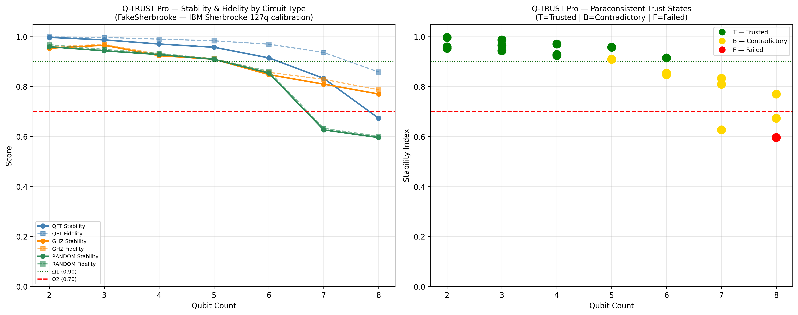

# Q-TRUST Pro — Quantum Circuit Trust Evaluation Engine

Paraconsistent trust evaluation for quantum hardware reliability.  
Built by LoopEi LLC · USPTO App. No. 19/303,438

---

## Social Impact

Quantum computing is entering production systems that influence drug
discovery, financial optimization, and cryptographic security. As QPU
access scales through cloud platforms, one question becomes critical:

**Should you trust the results coming off quantum hardware?**

Wrong trust decisions have real human consequences. Q-TRUST provides
the evaluation layer that catches hardware degradation, session
instability, and reproducibility failure before results are acted upon.

---

## The Problem

Standard fidelity checks average across trials — masking hardware
drift, session instability, and reproducibility failure. A circuit
can look acceptable on paper while your QPU is degrading in real time.

Q-TRUST answers: **should this circuit be trusted to run on QPU right now?**

---

## Approach

Four metrics drive the evaluation:

| Metric | Method |
|--------|--------|
| **Hellinger Fidelity** | Distribution distance from clean baseline |
| **MAD Drift** | Trial-to-trial instability, robust to outliers |
| **Reproducibility** | Cosine similarity across consecutive trial pairs |
| **Stability Index** | `mean_fidelity × (1 − drift) × reproducibility` |

Paraconsistent trust states — derived from the LoopEi Framework's
triadic logic, the same framework that provides a formal computational
substrate for holding contradictory quantum measurement outcomes
without forcing binary resolution:

| State | Meaning |
|-------|---------|
| **T** | Trusted |
| **F** | Failed |
| **B** | Contradictory — hold for human review |

Ω stability tiers:

| Tier | Stability |
|------|-----------|
| Ω1_CERTIFIED | ≥ 0.90 |
| Ω2_OPERATIONAL | ≥ 0.70 |
| Ω3_UNSTABLE | < 0.70 |

---

## Results — FakeSherbrooke (IBM Sherbrooke 127q)

Validated February 21, 2026. Baseline seed=42. Trial seeds=103, 211, 307 (prime-seeded).

```
Circuit  | Q | Fid    | ±CI      | Drift    | Repro  | Stab   | State | Tier
QFT      | 2 | 0.9988 | ±0.00062 | 0.000474 | 0.9987 | 0.9971 | T     | Ω1_CERTIFIED
QFT      | 5 | 0.9840 | ±0.00171 | 0.001420 | 0.9624 | 0.9457 | T     | Ω1_CERTIFIED
QFT      | 7 | 0.9397 | ±0.00358 | 0.002860 | 0.8899 | 0.8338 | B     | Ω2_OPERATIONAL
QFT      | 8 | 0.8396 | ±0.01337 | 0.011084 | 0.7917 | 0.6574 | B     | Ω3_UNSTABLE
GHZ      | 3 | 0.9694 | ±0.00429 | 0.003132 | 0.9993 | 0.9657 | T     | Ω1_CERTIFIED
GHZ      | 6 | 0.8464 | ±0.02993 | 0.024781 | 0.9987 | 0.8243 | B     | Ω2_OPERATIONAL
GHZ      | 8 | 0.7860 | ±0.01333 | 0.010490 | 0.9986 | 0.7767 | B     | Ω2_OPERATIONAL
RANDOM   | 4 | 0.9329 | ±0.00601 | 0.004991 | 1.0000 | 0.9283 | T     | Ω1_CERTIFIED
RANDOM   | 7 | 0.6331 | ±0.01143 | 0.009332 | 0.9995 | 0.6269 | B     | Ω3_UNSTABLE
RANDOM   | 8 | 0.6012 | ±0.00922 | 0.007595 | 0.9993 | 0.5963 | F     | Ω3_UNSTABLE
```



---

## Hardware

FakeSherbrooke — real IBM Sherbrooke 127-qubit calibration data.

---

## Installation

```bash
pip install qiskit qiskit-aer qiskit-ibm-runtime matplotlib numpy
```

## Usage

```bash
py lqtrust.py              # Standard run
py lqtrust.py --qubits 10  # Custom qubit count
py lqtrust.py --export     # Export JSON and CSV
py lqtrust.py --no-plot    # Skip plot
py lqtrust.py --providers  # Provider comparison demo
```

---

## Built For

**Q-volution Hackathon 2026** — Track D: Social Impact  
Sponsored by Infleqtion UK · Girls in Quantum · Feb 23 – Mar 1, 2026

---

*© 2025 LoopEi LLC · USPTO App. No. 19/303,438 · Inventor: Franklyn Ernesto Beltré*
